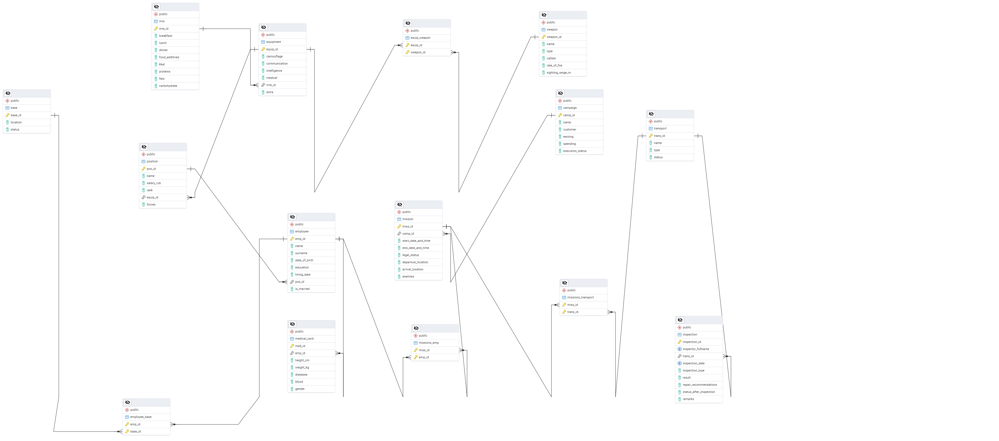
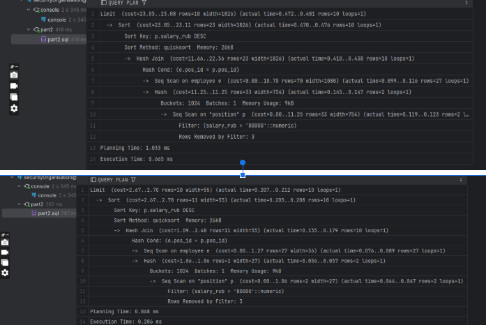

# Mission and Personnel Management System for a Private Security Organization

## 1. Description of the Subject Area

### Description

[ЗДЕСЬ НА РУССКОМ ЯЗЫКЕ](https://docs.google.com/document/d/1Zj_pr4qGuke_kmbw4Rk0ilT7BHBjT9SA/edit?usp=sharing&ouid=117162629703589900001&rtpof=true&sd=true)

A private security organization has a staff of **EMPLOYEES** who can hold various **POSITIONS**. 
Each employee has a **MEDICAL CARD** and is assigned to a **BASE**, which is their primary location. 
Employees can be assigned to **TASKS**. 
A task is an important part of a security **CAMPAIGN** on **TRANSPORT** owned by the security organization.

For safety, it is important to maintain a history of all **VEHICLE INSPECTIONS**. 
Employees must be provided with sets of **EQUIPMENT**. 
The equipment must include one MRE (Meal Ready-to-Eat) and may contain one or more **WEAPONS**.

### Rules

**_EMPLOYEES_**: Employees, it is necessary to know their FIRST NAME, LAST NAME, DATE OF BIRTH, EDUCATION, and current MARITAL STATUS, as well as store their ENLISTMENT DATE.

**_POSITIONS_**: POSITION TITLE, SALARY, MILITARY RANK (if applicable), EQUIPMENT SET NUMBER, and TYPE OF ARMED FORCES (employees can also hold civilian positions).

**_MEDICAL CARD_**: Contains information about HEIGHT in cm, WEIGHT in kg, BLOOD TYPE (AB0 system), PAST INJURIES/ILLNESSES, and BIOLOGICAL SEX.

**_BASE_**: Contains information about the BASE LOCATION and its STATUS.

**_MISSIONS_**: It is necessary to store the NAME, START DATE AND TIME, END DATE AND TIME, LEGAL STATUS, DEPARTURE and ARRIVAL LOCATIONS, ENEMIES, as well as the mission history of employees.

**_ORGANIZATION_**: Must contain the NAME, CLIENT, PROFIT, EXPENSES, and COMPLETION STATUS.

**_TRANSPORT_**: NAME, TYPE, CONDITION.

**_EQUIPMENT_**: May include (but is not mandatory) CAMOUFLAGE, COMMUNICATION DEVICES, RECONNAISSANCE TOOLS, MEDICAL SUPPLIES, and OTHER ITEMS. 
It must include one MRE (with details about PROTEINS, FATS, CARBOHYDRATES, CALORIES, BREAKFAST, LUNCH, DINNER DISHES, and DIETARY SUPPLEMENTS).

**_WEAPONS_**: With technical specifications, such as NAME, TYPE, CALIBER, RATE OF FIRE, BARREL LENGTH, and EFFECTIVE RANGE.

### Business Processes

Individuals without the necessary qualifications cannot be assigned to security tasks. 
The information system must track which employees are on tasks (the same employee cannot be on two tasks simultaneously). 
It is prohibited to hire employees with unsuitable physical conditions as security personnel. 
It is necessary to maintain a history of vehicle inspections, and vehicles with statuses "broken" or "under repair" cannot be used in operations. 
If no employees are assigned to a base, it should be closed. All else being equal, prioritize sending unmarried employees who have not participated in tasks for a long time and have extensive experience.

## 2. Models



## 3. Database Structure Improvement

### Normalization (Database Normalization)
Sub. Description [wikipedia](https://ru.wikipedia.org/wiki/%D0%9D%D0%BE%D1%80%D0%BC%D0%B0%D0%BB%D1%8C%D0%BD%D0%B0%D1%8F_%D1%84%D0%BE%D1%80%D0%BC%D0%B0)

Normalization allows for optimal distribution of attributes across tables. This methodology eliminates:
- Attributes with multiple values;
- Repeating attributes;
- Attributes that cannot be classified;
- Attributes with redundant information;
- Attributes derived from other features.

1. First Normal Form (1NF)
A table is in 1NF if it has atomic values (no repeating groups or arrays) and each row is uniquely identified by a primary key.
My schemas already comply with 1NF, as each column contains atomic values, and primary keys are defined for all tables.

2. Second Normal Form (2NF)
A table is in 2NF if:
It is in 1NF.
All non-key attributes are fully functionally dependent on the primary key (no partial dependency).
My schemas already comply with 2NF.

3. Third Normal Form (3NF)
A table is in 3NF if:
It is in 2NF.
There is no transitive dependency, meaning non-key attributes should not depend on other non-key attributes.

Employee table: The table includes a reference to the foreign key base_id, which can be considered a transitive dependency.<br/>
Instead of directly storing base_id, I can create a new table that links employees to their base and remove the direct reference from the employee table.
To solve this issue, I create a separate employee_base table:

```sql
CREATE TABLE employee_base (
    emp_id INTEGER NOT NULL REFERENCES employee ON DELETE CASCADE,
    base_id INTEGER NOT NULL REFERENCES base ON DELETE SET NULL,
    PRIMARY KEY (emp_id, base_id)
);
```

This eliminates the transitive dependency on base_id in the employee table and improves 3NF.

4. Boyce-Codd Normal Form (BCNF)
A table is in BCNF if:
It is in 3NF.
For every non-trivial functional dependency, the determinant is a candidate key.
The employee_base table described above will help ensure there are no non-trivial functional dependencies violating BCNF.

After this, let's consider which queries will be most frequently used (in demand) for this database. In my case, I think we will typically need:
- Retrieve employee data, update it, and get information about employee health,
- Know about various missions, income, and clients,

As well as the status of our transport.
Based on this, let's use some useful methods to improve the performance of this database:

### Temporary Structures and Views, Query Validation Methods
Views and Materialized Views

A materialized view in a database functions similarly to a regular view but with one key difference: it caches the result of the view query,

storing it as a physical table. This means that unlike a standard view, where the underlying query is executed every time it is accessed,

a materialized view displays the saved data until it is refreshed. This can significantly improve the performance of complex queries that do not require real-time data.

### Indexes

First, I checked frequently used columns and created a sample of some indexes that I believe will be important for improving database performance.
Note that I chose a hash index for columns based on identifiers because:
- Hash indexes are optimized for equality searches (e.g., WHERE id = ?), which is typical for ID columns.
- Hash indexes provide fast search times with an average time complexity of O(1), making them suitable for primary keys and unique identifiers.

Since ID columns are often used in exact matches (=), hash indexes can efficiently handle these queries.

On the other hand:

B-tree indexes are suitable for range queries (e.g., WHERE column > ? or WHERE column BETWEEN ? AND ?), which is typical for non-ID columns.

B-tree indexes support efficient sorting and ordering, making them ideal for columns used in ORDER BY and GROUP BY clauses.

B-tree indexes can perform both equality (=) and range (<...>) searches, making them a good choice for columns with various query patterns.

Sometimes indexes do not always work properly. Or we may create indexes that are not actually important for the database. So, I decided to perform some checks that would allow me to remove unused indexes.

```sql
SELECT relname , indexrelname , idx_scan , idx_tup_read , idx_tup_fetch
FROM pg_stat_user_indexes
WHERE schemaname = 'public' and
  relname in ('campaign');
```
### Common Table Expressions (CTE) and Temporary Tables

CTEs and temporary tables serve similar purposes. Both generate intermediate results for a query,

without leaving permanent objects in the database; this saves storage space. But there are important differences: for CTEs, code reuse is limited to a single query.
On the other hand, data stored in a temporary table can be reused multiple times in various queries. A key requirement is that these queries are executed within the same database connection (session).
I chose CTEs for summarizing (employee health status and transport availability) because it simplifies the query and makes it more readable.

They also allow breaking down complex logic into smaller, manageable parts.

On the other hand, I chose a temporary table for determining job availability, as it allows storing and manipulating intermediate results,

which can be used multiple times in a query (e.g., during the day if additional employees are needed somewhere) or in multiple queries.

### EXPLAIN ANALYZE

EXPLAIN: Provides you with a detailed query plan that shows how PostgreSQL plans to execute your SQL query.

You can run EXPLAIN before a SELECT query to see what steps PostgreSQL will take to retrieve the data (e.g., whether it uses an index, performs a sequential scan, joins, etc.).

EXPLAIN ANALYZE: Actually runs the query and shows the actual execution time, helping you understand how efficiently the query is executed. It also shows the number of rows processed at each step.
Example usage before and after one of the indexes. You can notice that the query execution time has decreased.




VACUUM

PostgreSQL uses a versioning system (MVCC), so when rows are updated or deleted,
disk space is not immediately freed. Over time, this can lead to table bloat.
Running VACUUM helps reclaim space and can also improve performance.

VACUUM: Frees up space and analyzes the table to update statistics.

VACUUM FULL: Rewrites the table entirely, freeing up space, but is more costly and can lock the table for some time.

4. Triggers and Transactions
Let's create functions and then triggers. Functions are created according to the business process
I provided (see Business Process section).

I also decided to add stored procedures. Stored procedures perform larger actions and can modify data (typically used for performing common database operations,
data processing, and automating complex tasks.

They are particularly valuable for enhancing database security, modularity, automating complex tasks, and code reuse),
while functions focus on calculations and data retrieval, providing flexibility.

A. Functions

Function to check an employee's qualifications (e.g., if the employee is a medic or pilot).

Function to get unmarried, available, and experienced employees (according to the business process I provided, unmarried and experienced employees should be the first to be sent on missions, especially long-term missions, if available).

B. Triggers

Trigger function to check medical fitness (sick employees should not be sent on missions).

Close a base if it has no employees.

Open a base if it has at least one employee.

Trigger for campaigns, automatically updating the materialized view when a campaign is added, updated, or deleted.

Prevent mission overlaps (one employee cannot be sent on two different missions simultaneously).

Function to update transport status after inspection.

Function to check transport status before adding it to a mission (only inspected and maintained transport can be added to missions).

C. Transactions

Assigning an employee to a mission with various checks (checking employee availability, transport status, and its availability; if any check fails, roll back the entire transaction).

Like the first transaction, but also check qualifications (e.g., if we want to send an employee who is a pilot on a mission, we first check if they are a pilot, then perform other checks).

D. Procedure

Update the completion status to "COMPLETED" for campaigns where all related missions are completed (after the end_date_and_time).

Updates:

Creating or updating a temporary table (from project no. 2) to include unmarried, available, experienced employees, as well as their mission count and marital status.

Added an index on the date, as I understood this is important for the task.
